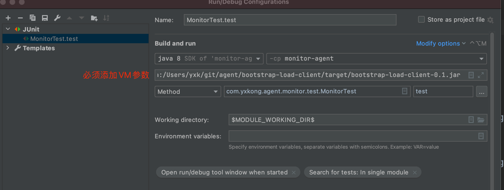

### com.yxkong.agent目录结构
#### ByteBuddyAgent  为主类
- 增强ThreadPoolExecutor类
- 初始化httpServer

#### advice  为 具体的增强
#### dto 为传输包装
#### httpserver 
- 实现了http服务（参考zabbix的jmx_exporter）
- 功能服务必须继承Collector，同时在构造方法里设置methodName，
- 实现collect 接口，就是具体要干的事，以及对应的返回参数
- 在ByteBuddyAgent.initHttpServer()方法中实例化一个对象并且register()
如  new ThreadPoolCollector().register();
  
### 主要实现功能
- JVMCollector  jvm的监控
- StackCollector 当前栈信息收集
- ThreadPoolCollector 线程池收集
- ThreadPoolModify  线程池部分信息修改
### 注意事项：


### 测试
MonitorTest

控制台输出：
```
获取ThreadPoolMonitorData的类加载器：null
获取ThreadPoolMonitorData收集的线程池：{}
获取ThreadPoolMonitor的类加载器：sun.misc.Launcher$AppClassLoader@18b4aac2
线程池pool执行中1:biz-pool-3-thread-1
线程池pool执行中2:biz-pool-3-thread-2
线程池pool执行中3:biz-pool-3-thread-3
线程池executorService执行中1:pool-1-thread-1
线程池启动完再获取收集的线程池：
{"616881582":{"executor":{"activeCount":0,"threadFactory":{},"largestPoolSize":1,"poolSize":1,"taskCount":1,"rejectedExecutionHandler":{},"corePoolSize":0,"completedTaskCount":1,"terminating":false,"maximumPoolSize":2147483647,"queue":[],"shutdown":false,"terminated":false},"name":"616881582","desc":"未使用提供的NamedThreadFactory"},"biz":{"executor":{"activeCount":0,"threadFactory":{"name":"biz","desc":"业务执行线程池"},"largestPoolSize":3,"poolSize":3,"taskCount":3,"rejectedExecutionHandler":{},"corePoolSize":5,"completedTaskCount":3,"terminating":false,"maximumPoolSize":10,"queue":[],"shutdown":false,"terminated":false},"name":"biz","desc":"业务执行线程池"}}
```


